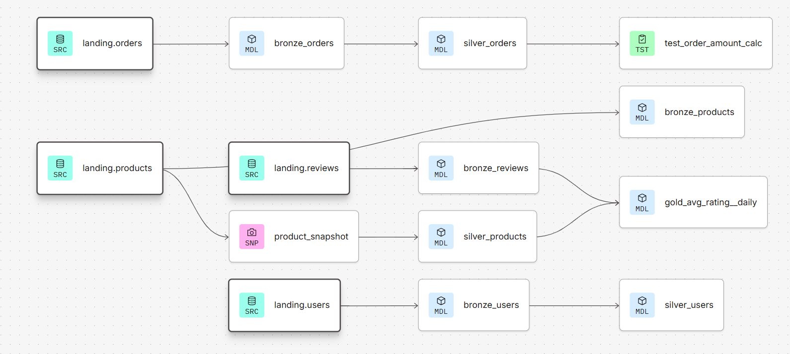
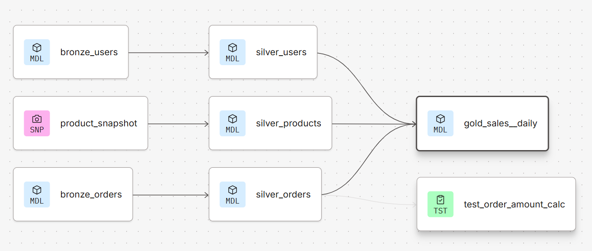
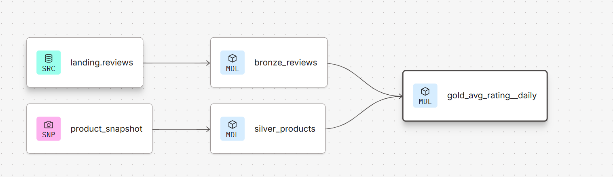

# dbt Databricks Medallion Lakehouse Project

## Overview

This project demonstrates the implementation of an end-to-end Medallion Lakehouse architecture using **dbt** on **Databricks**. The pipeline ingests raw e-commerce datasets into the Bronze layer, applies business transformations in the Silver layer, and produces analytics-ready Gold models for reporting.

The project also demonstrates dbt best practices including:

- Source definitions
- Data quality testing
- Unit testing
- Snapshotting (Slowly Changing Dimensions)
- Model lineage
- Modular SQL transformations
- Documentation through YAML
- Reusable model references using `ref()` and `source()`

---

## Project Architecture

```
Landing Sources
│
├── Orders
├── Products
├── Reviews
└── Users
        │
        ▼
Bronze Layer
│
├── bronze_orders
├── bronze_products
├── bronze_reviews
└── bronze_users
        │
        ▼
Silver Layer
│
├── silver_orders
├── silver_products
└── silver_users
        │
        ▼
Gold Layer
│
├── gold_sales__daily
└── gold_avg_rating__daily
```

---

## Data Lineage

The project follows the Medallion Architecture shown below.


### Orders Pipeline

```
landing.orders
      │
      ▼
bronze_orders
      │
      ▼
silver_orders
      │
      ▼
Unit Test
```

---

### Products Pipeline

```
landing.products
        │
        ├─────────────► bronze_products
        │
        ▼
product_snapshot
        │
        ▼
silver_products
```

---

### Reviews Pipeline

```
landing.reviews
       │
       ▼
bronze_reviews
       │
       └──────────────┐
                      ▼
              gold_avg_rating__daily
```

---

### Users Pipeline

```
landing.users
      │
      ▼
bronze_users
      │
      ▼
silver_users
      │
      └──────────────┐
                     ▼
             gold_sales__daily
```

---

# Technology Stack

| Category | Technologies |
|-----------|--------------|
| Data Warehouse | Databricks |
| Transformation | dbt Core |
| Language | SQL, YAML |
| File Format | Parquet |
| Testing | dbt Tests, dbt Unit Tests |
| Snapshotting | dbt Snapshots |
| Version Control | Git & GitHub |

---

# Project Structure

```
dbt-databricks-project
│
├── models
│   ├── bronze
│   │      bronze_orders.sql
│   │      bronze_products.sql
│   │      bronze_reviews.sql
│   │      bronze_users.sql
│   │
│   ├── silver
│   │      silver_orders.sql
│   │      silver_products.sql
│   │      silver_users.sql
│   │
│   └── gold
│          gold_sales__daily.sql
│          gold_avg_rating__daily.sql
│
├── snapshots
│      product_snapshot.sql
│
├── tests
│
├── macros
│
├── seeds
│
├── dbt_project.yml
└── packages.yml
```

---

# Source Data

The project uses four landing tables.

| Table | Description |
|--------|-------------|
| Orders | Customer purchase transactions |
| Products | Product master information |
| Reviews | Customer product ratings |
| Users | Customer demographic information |

---

# Bronze Layer

The Bronze layer stores raw data from the landing tables with minimal transformations.

Models:

- bronze_orders
- bronze_products
- bronze_reviews
- bronze_users

Purpose:

- Preserve raw source data
- Maintain schema consistency
- Provide a reliable ingestion layer
- Enable downstream transformations

---

# Silver Layer

The Silver layer cleans and standardizes the data for business consumption.

### silver_orders

Business transformations include:

- Order date extraction
- Order amount calculation

```sql
order_amount = quantity × unit_price
```

---

### silver_products

Uses a dbt Snapshot to preserve historical product changes.

Columns include

- Product Name
- Category
- Vendor
- Price

---

### silver_users

Transforms user information by

- Extracting birth year
- Standardizing location
- Renaming source to Sales Channel

---

# Gold Layer

The Gold layer contains analytics-ready models.

---

## gold_sales__daily

Combines

- Orders
- Products
- Users

Produces

- Daily Revenue
- Product
- Vendor
- Category
- City
- State
- Sales Channel

This model can directly power BI dashboards.

---

## gold_avg_rating__daily

Combines

- Reviews
- Products

Calculates

- Average Rating
- Product Rating by Day

---

# Data Quality Testing

The project implements multiple dbt tests.

## Source Tests

- Unique
- Not Null

Applied on

- Orders
- Products
- Reviews
- Users

---

## Column Tests

### Accepted Values

The Product Category column validates only the following values

```
Doohickey
Widget
Gizmo
Gadget
```

---

### Relationship Test

Ensures

```
bronze_products.id
```

exists in

```
bronze_orders.product_id
```

---

## Expression Tests

Validates

- Quantity >= 0
- Unit Price >= 0

using

```
dbt_utils.expression_is_true
```

---

## Unit Test

A dbt Unit Test validates the Order Amount calculation.

Input

```
Quantity = 10
Unit Price = 100
```

Expected Output

```
Order Amount = 1000
```

This ensures business logic remains correct as the project evolves.

---

# Snapshot

The project implements a dbt Snapshot for the Product table.

Purpose

- Track historical product changes
- Preserve previous values
- Support Slowly Changing Dimensions (SCD Type 2)

This enables historical reporting even when product attributes change.

---

# Materializations

| Layer | Materialization |
|---------|----------------|
| Bronze | Table |
| Silver | Table |
| Gold | View |

---

# Model Dependencies

The project uses

- `source()`
- `ref()`

to automatically build dependency graphs and model lineage.

Benefits include

- Automatic execution order
- Dependency tracking
- Easy maintenance
- Reusable transformations

---

# Business Use Cases

The transformed datasets can support

- Daily Sales Reporting
- Product Performance Analysis
- Customer Analytics
- Vendor Performance
- Product Rating Trends
- Revenue Analysis
- Geographic Sales Analysis
- Executive Dashboards

---

# Running the Project

Install dependencies

```bash
dbt deps
```

Run all models

```bash
dbt run
```

Execute tests

```bash
dbt test
```

Run snapshots

```bash
dbt snapshot
```

Build the entire project

```bash
dbt build
```

Generate documentation

```bash
dbt docs generate
```

Serve documentation

```bash
dbt docs serve
```

---

# Key dbt Features Demonstrated

- Medallion Architecture
- dbt Sources
- dbt Models
- dbt Snapshots
- YAML Documentation
- Generic Tests
- Unit Testing
- Relationship Testing
- Accepted Values Testing
- Expression Testing
- Modular SQL Development
- Model Lineage
- Automatic Dependency Management

---

# Future Improvements

- Incremental Models
- CI/CD using GitHub Actions
- dbt Cloud Deployment Jobs
- Data Freshness Monitoring
- Schema Evolution Handling
- Source Freshness Tests
- Exposure Definitions
- Semantic Layer Metrics
- Automated Documentation Deployment

---

# Author

**Omkar Sai Munjuluri**

Data Engineer specializing in modern data engineering using Databricks, dbt, Spark, SQL, and cloud-based analytics platforms.

---
